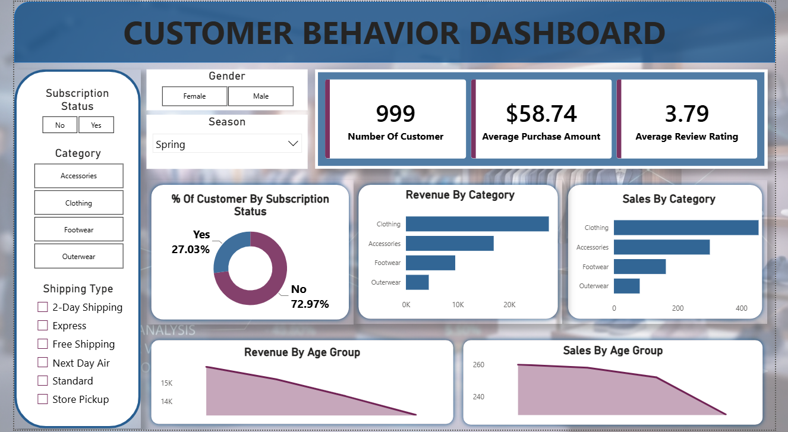

# customer-shopping-behavior-analysis

## PROJECT OVERVIEW

This project presents an end-to-end Customer Behavior Analysis solution developed using Python, PostgreSQL, SQL, and Power BI. The objective of the project is to analyze customer purchasing behavior, identify revenue-generating segments, evaluate product performance, understand subscription trends, and provide actionable business insights through data-driven decision-making.

The project demonstrates the complete Data Analytics workflow, starting from data cleaning and preprocessing, followed by database management and SQL analysis, and ending with dashboard development, reporting, and presentation.

---

## PROJECT OBJECTIVE

The primary objectives of this project are:

- Analyze customer purchasing behavior and spending patterns.
- Identify high-performing product categories and products.
- Evaluate customer loyalty and repeat purchase behavior.
- Understand subscription adoption among customers.
- Measure revenue contribution across customer segments.
- Develop an interactive dashboard for business stakeholders.
- Generate actionable recommendations based on data insights.

---

## TOOLS & TECHNOLOGIES USED

### Programming & Data Analysis
- Python
- Pandas
- NumPy

### Database Management
- PostgreSQL
- SQLAlchemy

### Query Language
- SQL

### Data Visualization
- Power BI

### Documentation & Reporting
- Microsoft Excel
- Microsoft Word
- Microsoft PowerPoint

---

## DATASET SUMMARY

### Dataset Information

- Total Records: 3,900
- Total Columns: 18

### Features Included

#### Customer Information
- Customer ID
- Age
- Gender
- Location
- Subscription Status

#### Product Information
- Item Purchased
- Category
- Size
- Color
- Season

#### Transaction Information
- Purchase Amount
- Discount Applied
- Promo Code Used
- Shipping Type
- Payment Method

#### Behavioral Information
- Previous Purchases
- Frequency of Purchases
- Review Rating

### Data Quality

- Missing values identified in the Review Rating column.
- Missing ratings were handled using category-wise median imputation.
- Dataset was validated for consistency and usability before analysis.

---

## PROJECT WORKFLOW

### 1. DATA COLLECTION

- Imported customer shopping behavior dataset.
- Reviewed dataset structure and attributes.
- Identified numerical and categorical variables.

### 2. DATA CLEANING & PREPROCESSING USING PYTHON

The dataset was cleaned and prepared using Python libraries such as Pandas and NumPy.

Tasks performed:

- Loaded data into Pandas DataFrame.
- Checked dataset dimensions and structure.
- Identified missing values.
- Imputed missing Review Ratings using median values grouped by category.
- Renamed columns into standardized snake_case format.
- Performed duplicate checks.
- Created age_group feature for customer segmentation.
- Validated data quality and consistency.

### 3. DATABASE MANAGEMENT USING POSTGRESQL

- Created PostgreSQL database.
- Established connection between Python and PostgreSQL using SQLAlchemy.
- Loaded cleaned dataset into PostgreSQL.
- Verified successful table creation and data loading.

### 4. SQL ANALYSIS

Business questions were answered using SQL queries.

---

## BUSINESS QUESTIONS ANSWERED

### Customer Analysis

1. What is the total revenue generated by male and female customers?

2. Which customers used discounts and still spent more than the average purchase amount?

3. How can customers be segmented into New, Returning, and Loyal customers based on previous purchases?

4. Are repeat buyers more likely to subscribe?

### Product Analysis

5. Which are the top-rated products based on customer reviews?

6. What are the top three most purchased products within each category?

7. Which products have the highest percentage of purchases with discounts applied?

### Revenue Analysis

8. Which categories generate the highest revenue?

9. What is the revenue contribution of each age group?

10. How do purchasing behaviors vary across customer segments?

---

## SQL TECHNIQUES USED

Throughout the analysis, the following SQL concepts were applied:

- SELECT Statements
- WHERE Clauses
- GROUP BY
- ORDER BY
- Aggregate Functions
  - SUM()
  - AVG()
  - COUNT()
- CASE Statements
- Common Table Expressions (CTEs)
- Window Functions
  - ROW_NUMBER()
- Conditional Aggregations
- Data Segmentation Techniques

---

## POWER BI DASHBOARD

An interactive Power BI dashboard was developed to visualize key customer and business metrics.

### Dashboard Components

#### KPI Cards

- Total Customers
- Average Purchase Amount
- Average Review Rating

#### Interactive Filters

- Gender
- Category
- Subscription Status
- Season
- Shipping Type

#### Visualizations

- Revenue by Category
- Sales by Category
- Revenue by Age Group
- Sales by Age Group
- Customer Subscription Distribution

The dashboard enables dynamic exploration of customer behavior and business performance.

---

## DASHBOARD PREVIEW

### Overview Dashboard

---

## KEY INSIGHTS

### Customer Insights

- A significant percentage of customers were non-subscribers.
- Repeat buyers demonstrated stronger purchasing behavior.
- Loyal customers contributed substantially to overall business performance.

### Revenue Insights

- Clothing emerged as the highest revenue-generating category.
- Revenue contribution varied significantly across age groups.
- Certain customer segments generated consistently higher revenue.

### Product Insights

- Several products maintained strong sales performance and customer ratings.
- Products with higher customer ratings generally showed stronger purchase activity.

### Marketing Insights

- Discount campaigns influenced purchasing behavior.
- Subscription status impacted customer engagement and purchase frequency.
- Product preferences varied across customer demographics.

---

## BUSINESS RECOMMENDATIONS

### Increase Subscription Adoption

- Offer subscriber-exclusive discounts.
- Introduce loyalty rewards for subscribers.
- Provide premium shipping benefits.

### Strengthen Customer Loyalty

- Implement tier-based loyalty programs.
- Reward repeat purchases with personalized offers.

### Optimize Discount Strategies

- Focus discounts on products with higher conversion potential.
- Monitor discount effectiveness and profitability.

### Promote High-Performing Products

- Feature best-selling products in marketing campaigns.
- Increase visibility of highly-rated products.

### Target High-Value Customer Segments

- Develop age-specific marketing campaigns.
- Personalize recommendations based on purchase history.

---

## PROJECT FILES

| File Name | Description |
|------------|------------|
| customer_shopping_behavior.csv | Raw Dataset |
| Customer_Behavior_Analysis.ipynb | Python Data Cleaning and Analysis |
| SQL_Queries.sql | SQL Business Analysis Queries |
| Customer_Behavior_Dashboard.pbix | Power BI Dashboard |
| Customer_Behavior_Report.pdf | Detailed Project Report |
| Customer_Behavior_Presentation.pptx | Project Presentation |
| README.md | Project Documentation |

---

## SKILLS DEMONSTRATED

### Data Analysis

- Data Cleaning
- Data Wrangling
- Exploratory Data Analysis (EDA)
- Feature Engineering

### SQL

- Data Retrieval
- Aggregations
- Customer Segmentation
- Window Functions
- CTEs
- Business Analysis Queries

### Database Management

- PostgreSQL
- SQLAlchemy Integration

### Data Visualization

- Dashboard Design
- KPI Development
- Interactive Reporting
- Data Storytelling

### Business Intelligence

- Customer Analytics
- Revenue Analysis
- Product Performance Analysis
- Decision Support Reporting

---

## PROJECT OUTCOME

Successfully developed an end-to-end analytics solution that transformed raw customer transaction data into meaningful business insights using Python, PostgreSQL, SQL, and Power BI.

The project demonstrates practical Data Analyst skills including data preparation, database management, SQL querying, dashboard development, reporting, and business-focused analysis. It provides actionable recommendations that can support customer retention, revenue growth, and strategic decision-making.

